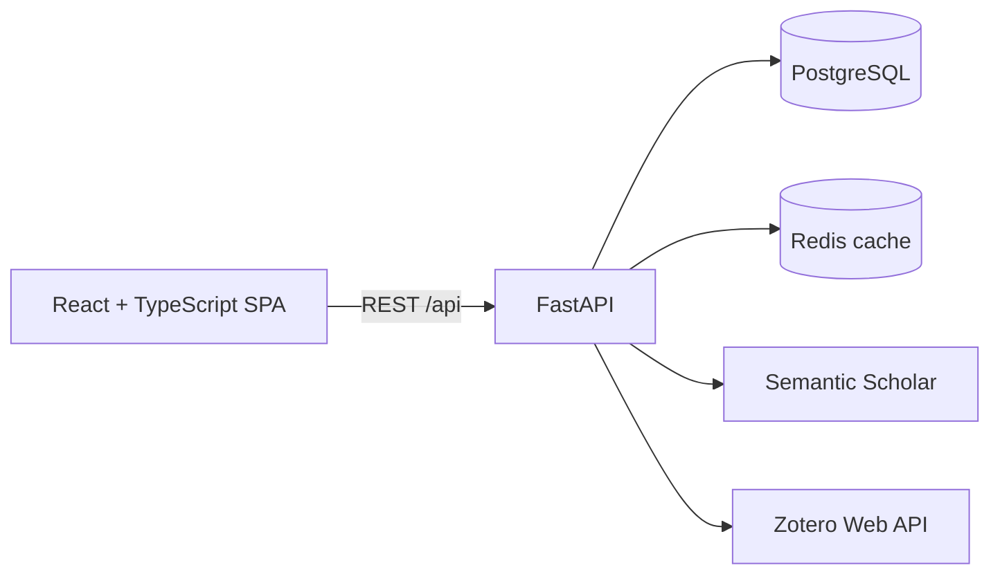

<p align="center"></p>

<h1 align="center">OpenBib</h1>

<p align="center">Discover, organize, and explore academic literature in one open workspace.</p>

<p align="center"><a href="https://github.com/GiuseppeSoriano/OpenBib/actions/workflows/ci.yml"></a> <a href="LICENSE"></a> <a href="CONTRIBUTING.md"></a> </p>

OpenBib is an open-source academic reference manager for searching across public bibliographic providers, building a personal research library, and exploring the citation graph around a paper or collection. This repository contains the source of official releases and everything needed to run and develop the application locally.

Search, paper details, collections shared through read-only links, and citation graphs work without an account. Signing in unlocks persistent collections, notes, tags, reading states, version pins, and one-way Zotero sync.

> [!IMPORTANT]
> OpenBib is currently an **alpha project**. The core workflows are usable, but APIs, data migrations, and user-facing behavior may change before the first stable release. Please back up important data.

## Try OpenBib online

Want to try or use OpenBib without installing it locally? Visit the hosted version at **[www.open-bib.com](https://www.open-bib.com)**. No local setup is needed. To self-host or contribute to the open-source project, follow the instructions below.

## Why OpenBib?

Academic discovery is spread across search engines, reference managers, and graph tools. OpenBib brings those workflows together in an application you can inspect, run locally and contribute to:

- **Discover papers with Semantic Scholar** — one authenticated source for search, metadata, references and citations, normalized and deduplicated before display.
- **Explore citation networks visually** — browse a paper's citers or references in ranked ranges of 30, pin the papers worth keeping, preserve node positions, and move directly from discovery to a paper's details.
- **Organize research your way** — maintain a library, version-aware collections, notes, tags, reading states, and collections with read-only links and authorized collaborators.
- **Keep Zotero in the workflow** — push a collection or the whole library to Zotero with an idempotent one-way sync.
- **Use it comfortably anywhere** — responsive UI, light and dark themes, and bundled English and Italian translations.
- **Stay useful during provider outages** — Redis caching, retries and explicit upstream errors keep the application responsive when an upstream API is slow.

## Architecture



| Layer | Technology |
| --- | --- |
| Frontend | React 18, TypeScript, Vite, TanStack Query, react-force-graph, i18next |
| Backend | Python 3.12, FastAPI, Pydantic v2, async SQLAlchemy 2, Alembic |
| Persistence | PostgreSQL 16 for user data and metadata snapshots; Redis 7 for short-lived provider caches |
| Delivery | Docker Compose, nginx, GitHub Actions |

The frontend and API are separate applications. PostgreSQL is the system of record; Redis is disposable and is never the sole home of user data. See [Persistence architecture](docs/Architecture/Persistence.md) for the full data ownership model.

## Quick start with Docker

### Requirements

- [Docker Engine](https://docs.docker.com/engine/install/) with Docker Compose v2
- Git

### Run OpenBib

```bash
git clone https://github.com/GiuseppeSoriano/OpenBib.git
cd OpenBib

cp .env.example .env
# Replace JWT_SECRET_KEY in .env with a strong, random secret.
# Set SEMANTIC_SCHOLAR_API_KEY to your Semantic Scholar API key.

docker compose up --build -d
```

> [!WARNING]
> The included Compose file is a local development setup. It binds services to localhost and uses development credentials; keep these ports private. Deployment of the official service is managed separately by the maintainers and is not required to use this repository.

Once the containers are healthy:

| Service | URL |
| --- | --- |
| Web application | <http://localhost:3000> |
| Interactive API docs | <http://localhost:3000/api/docs> |
| Local email inbox | <http://localhost:8025> |
| Health check | <http://localhost:8000/api/health> |

Inspect the stack with `docker compose ps` and follow API logs with `docker compose logs -f api`.

```bash
# Stop the application while preserving database data
docker compose down

# Delete the containers and the local PostgreSQL volume
docker compose down -v
```

> [!CAUTION]
> `docker compose down -v` permanently removes the local development database.

## Configuration

Copy [`.env.example`](.env.example) to `.env` before starting the Compose stack. These are the settings most installations need to review:

| Variable | Purpose | Default |
| --- | --- | --- |
| `DATABASE_URL` | Async PostgreSQL connection URL | Local `openbib` database |
| `REDIS_URL` | Redis connection URL | `redis://localhost:6379/0` |
| `JWT_SECRET_KEY` | Signs short-lived access tokens | Insecure development placeholder |
| `JWT_ACCESS_TOKEN_EXPIRE_MINUTES` | Access-token lifetime | `10` |
| `JWT_REFRESH_TOKEN_EXPIRE_DAYS` | Refresh-token lifetime | `7` |
| `SEMANTIC_SCHOLAR_API_KEY` | **Required.** Search, paper details, citation graphs, and resolving added or imported identifiers; sent only in the `x-api-key` header. Without it, search and live lookups return 503 `provider_not_configured`, graph ranges report the provider as unavailable, and added DOIs stay pending | Empty |
| `SEMANTIC_SCHOLAR_API_KEY_FILE` | Optional secret file, takes precedence | Empty |
| `DOI_RESOLVE_TIMEOUT_SECONDS` | Time budget for resolving one added identifier; a DOI still unresolved by then is saved as pending | `15` |
| `IMPORT_RESOLVE_CONCURRENCY` | Parallel doi.org checks for imported DOIs that Semantic Scholar does not know (the lookups themselves are batched, 500 per call) | `4` |
| `IMPORT_REQUEST_BUDGET_SECONDS` | Time budget for resolving one import request; lines left over are reported as pending or retryable | `25` |
| `GRAPH_RELATED_RANGE_SIZE` | Papers per related-paper range in the graph (5–100) | `30` |
| `GRAPH_RELATED_CHUNK_SIZE` | Semantic Scholar citation/reference page size (100–1000) | `1000` |
| `GRAPH_RELATED_MAX_RESULTS` | Depth cap in raw provider records per paper and direction (1000–10000); larger lists read "first 10,000 of N" | `10000` |
| `GRAPH_RELATED_PAGES_PER_REQUEST` | Provider pages fetched per request while a list is collected and ranked (1–10) | `4` |
| `GRAPH_RELATED_SCAN_BUDGET_SECONDS` | Time one graph request may spend collecting a list (at most 20) | `20` |
| `GRAPH_RELATED_TOPUP_CONCURRENCY` | Pinned sources expanded in parallel (1–8; the provider allows one call at a time) | `1` |
| `BACKUPS_ENABLED` | Declares that the operator keeps database backups; must match `legal.json` in production and requires the deletion journal | `true` in code, `false` in `.env.example` |
| `DELETION_JOURNAL_ENABLED` | Off-site S3 journal of account deletions, replayed after a restore; defaults to `BACKUPS_ENABLED` | Follows `BACKUPS_ENABLED` |
| `LEGAL_CONFIG_PATH` | Path to the operator's `legal.json`; required in production, development uses built-in placeholder data | Empty |
| `CORS_ORIGINS` | JSON list of allowed browser origins | Local web ports |
| `CACHE_TTL_*` | Provider-cache lifetimes in seconds | See `.env.example` |

Never commit `.env`, API keys, JWT secrets, database dumps, or Zotero credentials. The repository's `.gitignore` excludes the usual local secret files, but deployment secrets remain the operator's responsibility.

Run a single API worker per Semantic Scholar key: the client paces every provider call (searches, lookups, imports and graph list collection) through one process-local queue, one call every two seconds. See [Semantic Scholar integration](docs/Architecture/SemanticScholar.md).

### Backups

The Compose file includes an opt-in `backup` profile that writes verified, optionally encrypted `pg_dump` archives on a schedule (`docker compose --profile backup up -d backup`). It is off by default. [Database backups and restore](docs/Operations/Backups.md) covers encryption, off-host copies, what `BACKUPS_ENABLED` and `legal.json` must then say, and a tested restore runbook.

### Upgrading an existing installation

> [!WARNING]
> Migration `1d2e3f4a5b6c` is an irreversible data repair: it re-keys paper identifiers stored before input normalization existed (bare DOIs, `DOI:` labels, doi.org links) to `doi:<lowercase DOI>` and merges the duplicates this creates. Its downgrade is a no-op, so the only way back is a dump taken just before the upgrade. Follow [Before deploying migration 1d2e3f4a5b6c](docs/Operations/Backups.md#before-deploying-migration-1d2e3f4a5b6c), in this order:
>
> ```sh
> docker compose build                                   # the new release
> docker compose stop api mail-worker                    # no writes after the dump
> docker compose run --rm migrate python -m scripts.repair_paper_keys --dry-run
> docker compose --profile backup run --rm backup once   # or take your own pg_dump
> docker compose up -d                                   # migrate applies the migration first
> ```
>
> Run the preview through `migrate`, never `docker compose run api …`: `api` depends on `migrate`, which would apply the migration before the preview runs. See the [CHANGELOG](CHANGELOG.md) for breaking API changes.

## Local development

For host-based development you need Python 3.12+, Node.js 24 LTS, PostgreSQL 16+, and Redis 7+. You can run only the data services in Docker:

```bash
docker compose up -d db cache mailpit
```

### Backend

```bash
# If you do not already have a root .env:
cp -n .env.example .env
# Set SEMANTIC_SCHOLAR_API_KEY in .env. backend/.env overrides root values.
cd backend

uv sync --frozen --extra dev --python 3.12
uv run alembic upgrade head
uv run uvicorn app.main:app --reload --port 8000
```

On Windows PowerShell, activate the virtual environment with `.venv\Scripts\Activate.ps1`.

### Frontend

```bash
cd frontend
npm ci
npm run dev
```

Vite serves the application at <http://localhost:5173> and proxies `/api` to the backend at port `8000`.

## Tests and quality checks

Run the same checks used by CI before opening a pull request:

```bash
# Backend
cd backend
uv run ruff check app tests scripts alembic
uv run ruff format --check app tests scripts alembic
uv run pytest -q

# Frontend
cd frontend
npm run lint
npm test
npm run build
```

Application runtime images exclude test/development packages. CI runs PostgreSQL + Redis tests, clean/previous-head migrations, frontend checks, dependency audits, full-history Gitleaks, CodeQL, application image scans and SBOM generation. Operators separately verify their infrastructure and, when backups are enabled, encrypted backups and the restore procedure.

## Repository map

```text
.
├── backend/                 FastAPI application, migrations, and pytest suite
├── frontend/                React application and Vitest suite
├── docs/                    Architecture, requirements, and future work
├── .github/                 CI, issue forms, and pull-request template
├── docker-compose.yml       Local development stack with Mailpit
├── tools/                   CI scanners, the backup script, and the responsive regression script (see tools/README.md)
├── .env.example             Safe configuration template
├── CONTRIBUTING.md          Development and contribution workflow
├── CODE_OF_CONDUCT.md       Community standards
├── SECURITY.md              Private vulnerability-reporting policy
└── LICENSE                  MIT license
```

## Production and privacy

Registration follows email → six-digit OTP → name/password and legal acceptance → automatic sign-in. The password is requested only after mailbox verification. See [registration API, limits and local testing](docs/Architecture/RegistrationOTP.md). Access tokens stay in browser memory; opaque refresh sessions rotate in an HttpOnly cookie. Account settings provide verified email changes, password changes, session revocation, password-protected JSON export and account deletion. Zotero credentials and pending emails are encrypted with versioned application keys.

Every production operator supplies their own legal configuration and authenticated SMTP. Off-site encrypted backups are optional; without them database loss may be irreversible and the privacy notice must accurately disclose this. The application includes bilingual privacy/terms pages and only technical storage for sessions, theme and language: no analytics, trackers or consent banner are bundled. Legal texts still require human review for the actual operator and jurisdiction.

See [Security architecture](docs/Security.md) and [Privacy operations](docs/Privacy.md) for the application safeguards and data lifecycle.

This public repository contains reviewed official source snapshots with a separate release history. The maintainers keep development history, VM deployment scripts, instance configuration and operational procedures in their private repository. Cloning OpenBib gives you a local development environment; it does not require access to the official infrastructure.

## Documentation

- [Product vision](docs/Requirements/00-Vision.md)
- [Functional requirements](docs/Requirements/01-FunctionalRequirements.md)
- [Non-functional requirements](docs/Requirements/02-NonFunctionalRequirements.md)
- [System architecture](docs/Requirements/03-SystemArchitecture.md)
- [Provider integrations](docs/Requirements/04-APIIntegration.md)
- [Persistence architecture](docs/Architecture/Persistence.md)
- [Semantic Scholar integration](docs/Architecture/SemanticScholar.md)
- [Collection sharing](docs/Architecture/CollectionSharing.md)
- [Database backups and restore](docs/Operations/Backups.md)
- [Privacy operations](docs/Privacy.md)
- [Changelog](CHANGELOG.md)
- [Future work](docs/FutureWorks.md)
- OpenAPI documentation at `/api/docs` on a running instance

## Contributing

Contributions are welcome. Start with [CONTRIBUTING.md](CONTRIBUTING.md), search the existing issues, and use the issue forms for reproducible bug reports or focused feature proposals. By participating, you agree to follow the [Code of Conduct](CODE_OF_CONDUCT.md).

Please do not use public issues for vulnerabilities. Follow the private process in [SECURITY.md](SECURITY.md) instead.

## License

OpenBib is available under the [MIT License](LICENSE). By contributing, you agree that your contributions will be licensed under the same terms.

## Acknowledgements

OpenBib retrieves bibliographic data exclusively from [Semantic Scholar](https://www.semanticscholar.org/), with optional export to [Zotero](https://www.zotero.org/). OpenAlex, arXiv, Crossref and Europe PMC adapters remain available as inactive implementations.

See the [provider audit and endpoint mapping](docs/Architecture/SemanticScholar.md) for enablement, identity rules, operational limits and live test instructions.
