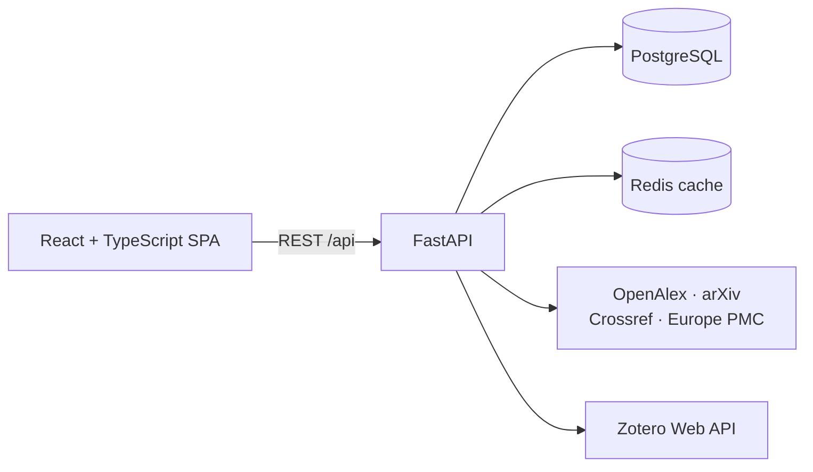

<p align="center"></p>

<h1 align="center">OpenBib</h1>

<p align="center">Discover, organize, and explore academic literature in one open workspace.</p>

<p align="center"><a href="https://github.com/GiuseppeSoriano/OpenBib/actions/workflows/ci.yml"></a> <a href="LICENSE"></a> <a href="CONTRIBUTING.md"></a> </p>

OpenBib is an open-source academic reference manager for searching across public bibliographic providers, building a personal research library, and exploring the citation graph around a paper or collection. This repository contains the source of official releases and everything needed to run and develop the application locally.

Search, paper details, public collections, and citation graphs work without an account. Signing in unlocks persistent collections, notes, tags, reading states, version pins, and one-way Zotero sync.

> [!IMPORTANT]
> OpenBib is currently an **alpha project**. The core workflows are usable, but APIs, data migrations, and user-facing behavior may change before the first stable release. Please back up important data.

## Why OpenBib?

Academic discovery is spread across search engines, reference managers, and graph tools. OpenBib brings those workflows together in an application you can inspect, run locally and contribute to:

- **Search four providers at once** — OpenAlex, arXiv, Crossref, and Europe PMC are queried in parallel, then deduplicated and grouped by paper version.
- **Explore citation networks visually** — expand citers or references, preserve node positions, and move directly from discovery to a paper's details.
- **Organize research your way** — maintain a library, version-aware collections, notes, tags, reading states, and public or collaborative collections.
- **Keep Zotero in the workflow** — push a collection or the whole library to Zotero with an idempotent one-way sync.
- **Use it comfortably anywhere** — responsive UI, light and dark themes, and bundled English and Italian translations.
- **Stay useful during provider outages** — Redis caching and graceful provider degradation keep the application responsive when an upstream API is slow.

## Architecture



| Layer | Technology |
| --- | --- |
| Frontend | React 18, TypeScript, Vite, TanStack Query, react-force-graph, i18next |
| Backend | Python 3.12, FastAPI, Pydantic v2, async SQLAlchemy 2, Alembic |
| Persistence | PostgreSQL 16 for user data and metadata snapshots; Redis 7 for short-lived provider caches |
| Delivery | Docker Compose, nginx, GitHub Actions |

The frontend and API are separate applications. PostgreSQL is the system of record; Redis is disposable and is never the sole home of user data. See [Persistence architecture](docs/Architecture/Persistence.md) for the full data ownership model.

## Quick start with Docker

### Requirements

- [Docker Engine](https://docs.docker.com/engine/install/) with Docker Compose v2
- Git

### Run OpenBib

```bash
git clone https://github.com/GiuseppeSoriano/OpenBib.git
cd OpenBib

cp .env.example .env
# Replace JWT_SECRET_KEY in .env with a strong, random secret.
# OPENALEX_EMAIL and CROSSREF_MAILTO should identify your API requests.

docker compose up --build -d
```

> [!WARNING]
> The included Compose file is a local development setup. It binds services to localhost and uses development credentials; keep these ports private. Deployment of the official service is managed separately by the maintainers and is not required to use this repository.

Once the containers are healthy:

| Service | URL |
| --- | --- |
| Web application | <http://localhost:3000> |
| Interactive API docs | <http://localhost:3000/api/docs> |
| Local email inbox | <http://localhost:8025> |
| Health check | <http://localhost:8000/api/health> |

Inspect the stack with `docker compose ps` and follow API logs with `docker compose logs -f api`.

```bash
# Stop the application while preserving database data
docker compose down

# Delete the containers and the local PostgreSQL volume
docker compose down -v
```

> [!CAUTION]
> `docker compose down -v` permanently removes the local development database.

## Configuration

Copy [`.env.example`](.env.example) to `.env` before starting the Compose stack. These are the settings most installations need to review:

| Variable | Purpose | Default |
| --- | --- | --- |
| `DATABASE_URL` | Async PostgreSQL connection URL | Local `openbib` database |
| `REDIS_URL` | Redis connection URL | `redis://localhost:6379/0` |
| `JWT_SECRET_KEY` | Signs short-lived access tokens | Insecure development placeholder |
| `JWT_ACCESS_TOKEN_EXPIRE_MINUTES` | Access-token lifetime | `10` |
| `JWT_REFRESH_TOKEN_EXPIRE_DAYS` | Refresh-token lifetime | `7` |
| `OPENALEX_API_KEY` | Optional OpenAlex API key | Empty |
| `OPENALEX_EMAIL` | Contact email for OpenAlex requests | Example address |
| `CROSSREF_MAILTO` | Contact email for Crossref polite-pool requests | Example address |
| `CORS_ORIGINS` | JSON list of allowed browser origins | Local web ports |
| `CACHE_TTL_*` | Provider-cache lifetimes in seconds | See `.env.example` |

Never commit `.env`, API keys, JWT secrets, database dumps, or Zotero credentials. The repository's `.gitignore` excludes the usual local secret files, but deployment secrets remain the operator's responsibility.

## Local development

For host-based development you need Python 3.12+, Node.js 24 LTS, PostgreSQL 16+, and Redis 7+. You can run only the data services in Docker:

```bash
docker compose up -d db cache mailpit
```

### Backend

```bash
cp .env.example backend/.env
cd backend

uv sync --frozen --extra dev --python 3.12
uv run alembic upgrade head
uv run uvicorn app.main:app --reload --port 8000
```

On Windows PowerShell, activate the virtual environment with `.venv\Scripts\Activate.ps1`.

### Frontend

```bash
cd frontend
npm ci
npm run dev
```

Vite serves the application at <http://localhost:5173> and proxies `/api` to the backend at port `8000`.

## Tests and quality checks

Run the same checks used by CI before opening a pull request:

```bash
# Backend
cd backend
uv run ruff check app tests scripts alembic
uv run ruff format --check app tests scripts alembic
uv run pytest -q

# Frontend
cd frontend
npm run lint
npm test
npm run build
```

Application runtime images exclude test/development packages. CI runs PostgreSQL + Redis tests, clean/previous-head migrations, frontend checks, dependency audits, full-history Gitleaks, CodeQL, application image scans and SBOM generation. The maintainers separately verify the official service's infrastructure, encrypted backups and restore procedure.

## Repository map

```text
.
├── backend/                 FastAPI application, migrations, and pytest suite
├── frontend/                React application and Vitest suite
├── docs/                    Architecture, requirements, and future work
├── .github/                 CI, issue forms, and pull-request template
├── docker-compose.yml       Local development stack with Mailpit
├── tools/                   Checksum-verified CI scanners
├── .env.example             Safe configuration template
├── CONTRIBUTING.md          Development and contribution workflow
├── CODE_OF_CONDUCT.md       Community standards
├── SECURITY.md              Private vulnerability-reporting policy
└── LICENSE                  MIT license
```

## Production and privacy

Registration requires email verification. Access tokens stay in browser memory; opaque refresh sessions rotate in an HttpOnly cookie. Account settings provide verified email changes, password changes, session revocation, password-protected JSON export and account deletion. Zotero credentials and pending emails are encrypted with versioned application keys.

Every production operator supplies their own legal configuration, authenticated SMTP and off-site encrypted backups. The application includes bilingual privacy/terms pages and only technical storage for sessions, theme and language: no analytics, trackers or consent banner are bundled. Legal texts still require human review for the actual operator and jurisdiction.

See [Security architecture](docs/Security.md) and [Privacy operations](docs/Privacy.md) for the application safeguards and data lifecycle.

This public repository contains reviewed official source snapshots with a separate release history. The maintainers keep development history, VM deployment scripts, instance configuration and operational procedures in their private repository. Cloning OpenBib gives you a local development environment; it does not require access to the official infrastructure.

## Documentation

- [Product vision](docs/Requirements/00-Vision.md)
- [Functional requirements](docs/Requirements/01-FunctionalRequirements.md)
- [Non-functional requirements](docs/Requirements/02-NonFunctionalRequirements.md)
- [System architecture](docs/Requirements/03-SystemArchitecture.md)
- [Provider integrations](docs/Requirements/04-APIIntegration.md)
- [Persistence architecture](docs/Architecture/Persistence.md)
- [Future work](docs/FutureWorks.md)
- OpenAPI documentation at `/api/docs` on a running instance

## Contributing

Contributions are welcome. Start with [CONTRIBUTING.md](CONTRIBUTING.md), search the existing issues, and use the issue forms for reproducible bug reports or focused feature proposals. By participating, you agree to follow the [Code of Conduct](CODE_OF_CONDUCT.md).

Please do not use public issues for vulnerabilities. Follow the private process in [SECURITY.md](SECURITY.md) instead.

## License

OpenBib is available under the [MIT License](LICENSE). By contributing, you agree that your contributions will be licensed under the same terms.

## Acknowledgements

OpenBib builds on bibliographic data and APIs provided by [OpenAlex](https://openalex.org/), [arXiv](https://arxiv.org/), [Crossref](https://www.crossref.org/), and [Europe PMC](https://europepmc.org/), with optional export to [Zotero](https://www.zotero.org/).
